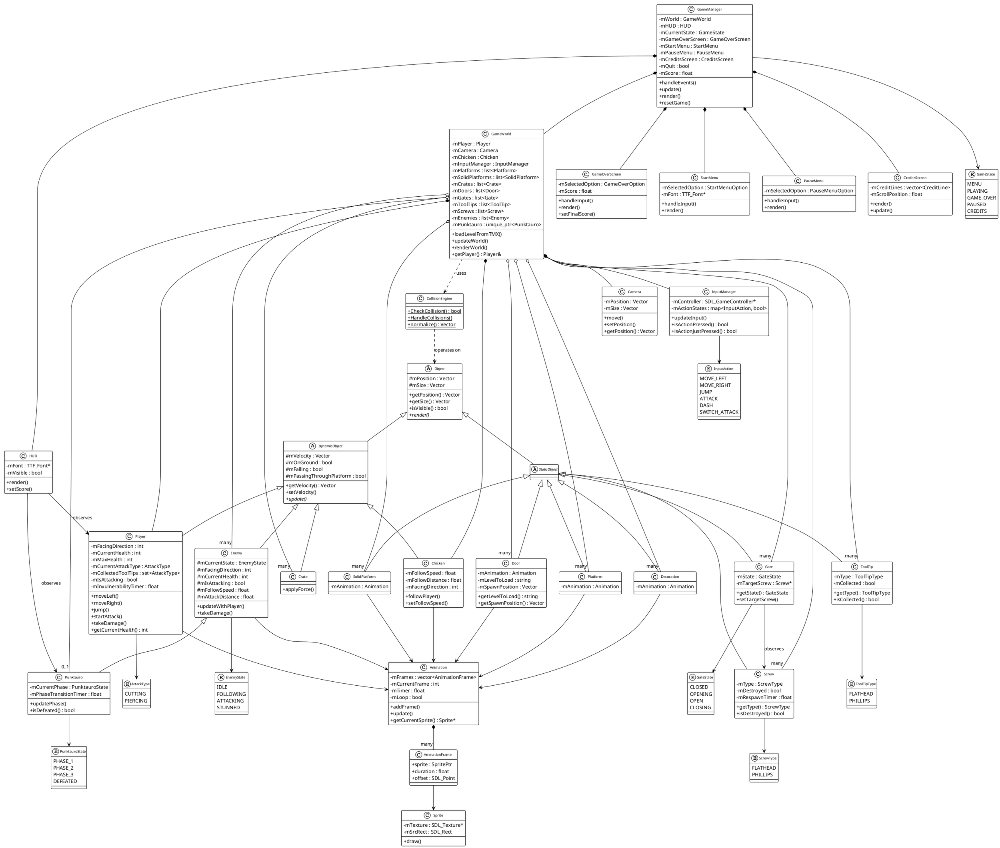

# Diagrama de Classes - A Rusty Screw Game

## Resumo da Arquitetura

### Hierarquia Principal de Objetos:
- **Object** (classe base abstrata)
  - **StaticObject** (objetos estáticos no mundo)
    - Platform, SolidPlatform, Door, Decoration, Gate, ToolTip, Screw
  - **DynamicObject** (objetos que se movem e têm física)
    - Player, Enemy (e Punktauro como subtipo), Chicken, Crate

### Gerenciamento Principal:
- **GameManager**: Classe central que coordena todo o jogo
- **GameWorld**: Gerencia todos os objetos do mundo do jogo
- **GameState**: Enum que controla o estado atual do jogo

### Sistemas de Suporte:
- **Animation/Sprite**: Sistema de gráficos e animação
- **Camera**: Sistema de câmera
- **InputManager**: Gerenciamento de entrada
- **CollisionEngine**: Sistema de detecção de colisões
- **HUD**: Interface do usuário

### Telas/Menus:
- StartMenu, PauseMenu, GameOverScreen, CreditsScreen

### Enums e Estados:
- Diversos enums para controlar estados de diferentes entidades (GameState, AttackType, EnemyState, etc.)

Esta arquitetura segue um padrão bem estruturado com separação clara de responsabilidades, hierarquia de objetos baseada em comportamento (estático vs dinâmico), e sistemas modulares de suporte.
